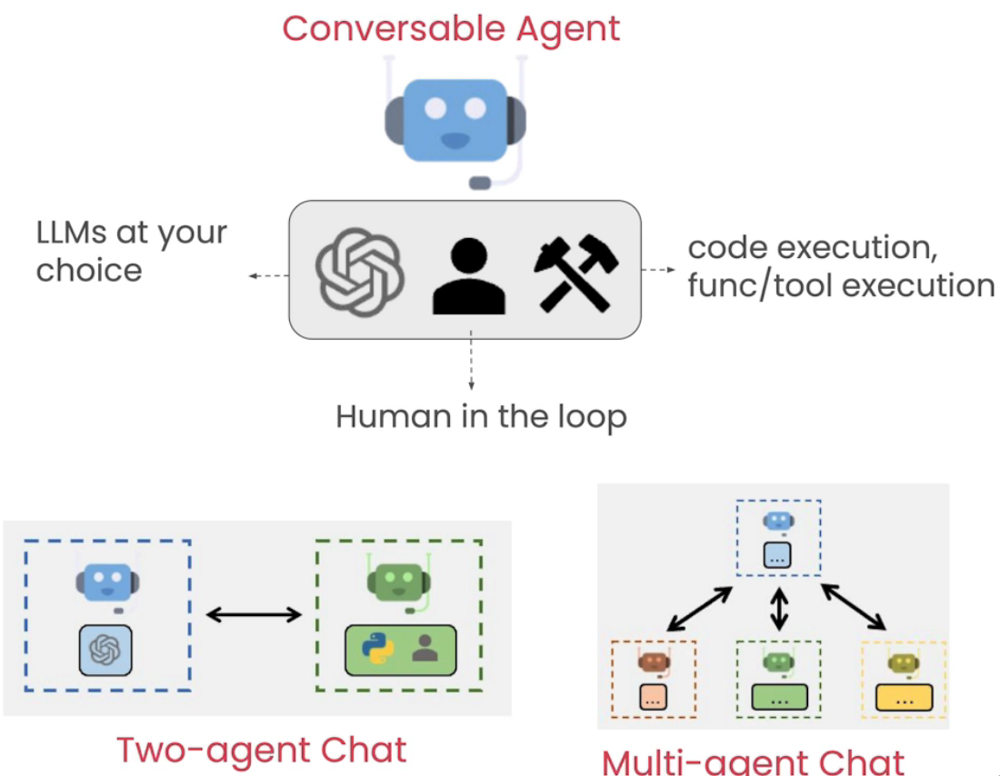
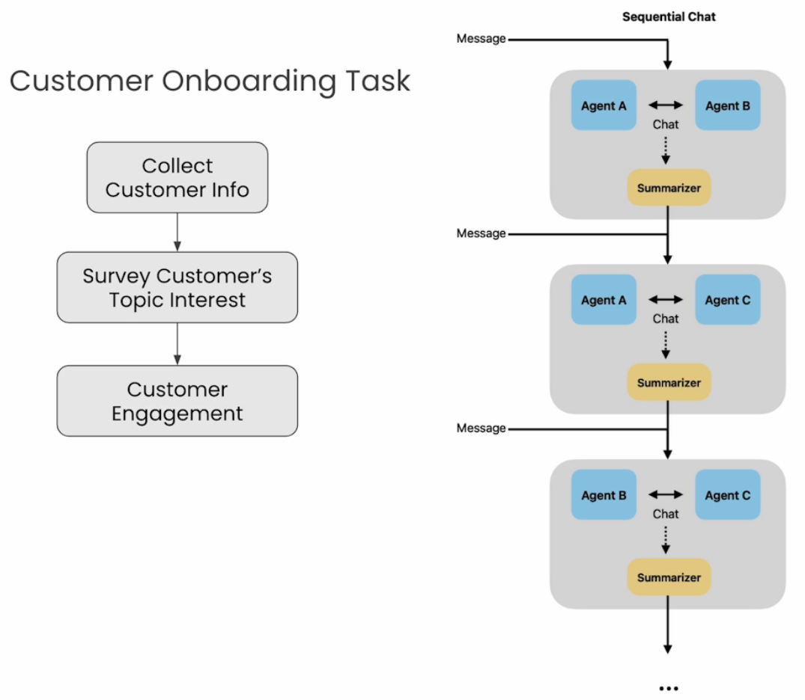
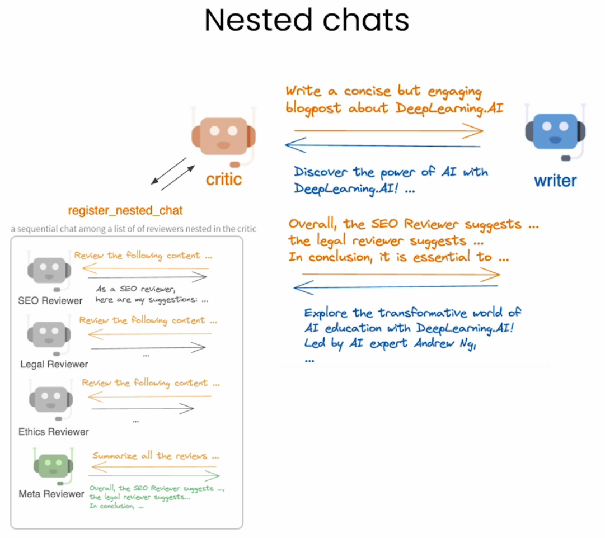
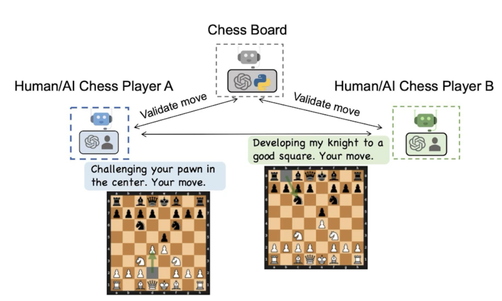
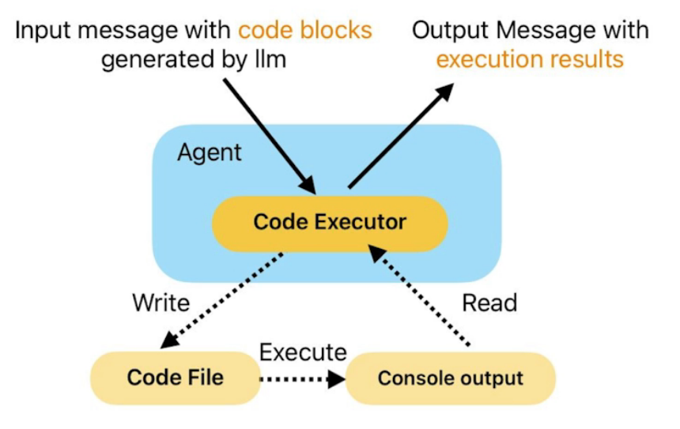
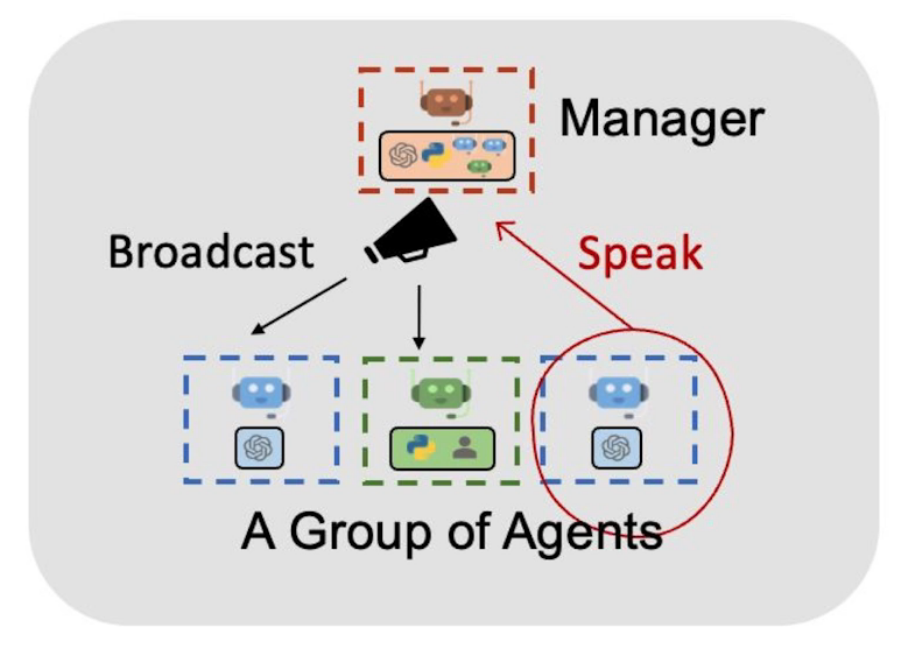

# 🤖 [AI Agentic Design Patterns with AutoGen](https://www.deeplearning.ai/short-courses/ai-agentic-design-patterns-with-autogen/)

💡 Welcome to the "AI Agentic Design Patterns with AutoGen" course! The course will equip you with the knowledge and skills to build and customize multi-agent systems using AutoGen.

## Course Summary
In this course, you'll explore key principles of designing multi-agent systems and enabling agents to collaborate on complex tasks using the AutoGen framework. Here's what you can expect to learn and experience:

1. 🎭 **Conversational Agents**: Create a two-agent chat showing a conversation between two standup comedians using “ConversableAgent,” a built-in agent class of AutoGen.

 

2. 🎉 **Customer Onboarding**: Develop a sequence of chats between agents to provide a fun customer onboarding experience for a product using the multi-agent collaboration design pattern.

 

3. 📝 **Blog Post Creation**: Use the agent reflection framework to create a high-quality blog post with nested chats, where reviewer agents reflect on the blog post written by another agent.

 

4. ♟️ **Chess Game**: Implement a conversational chess game where two agent players can call a tool and make legal moves on the chessboard using the tool use design pattern.

 

5. 💻 **Coding Agent**: Develop a coding agent capable of generating the necessary code to plot stock gains for financial analysis and integrating user-defined functions into the code.

 

6. 📊 **Financial Analysis**: Create systems where agents collaborate and seek human feedback to complete a financial analysis task, generating code from scratch or using user-provided code.

 

By the end of the course, you’ll have hands-on experience with AutoGen’s core components and a solid understanding of agentic design patterns, ready to implement multi-agent systems in your workflows.

## Key Points
- 🛠️ Use the AutoGen framework to build multi-agent systems with diverse roles and capabilities for implementing complex AI applications.
- 📚 Implement agentic design patterns such as Reflection, Tool Use, Planning, and Multi-agent Collaboration using AutoGen.
- 🌟 Learn directly from the creators of AutoGen, Chi Wang and Qingyun Wu.

## About the Instructors
🌟 **Chi Wang** is a Principal Researcher at Microsoft Research, bringing extensive expertise in AI and multi-agent systems to guide you through this course.

🌟 **Qingyun Wu** is an Assistant Professor at Penn State University, specializing in AI and multi-agent collaboration, to help you master agentic design patterns.

🔗 To enroll in the course or for further information, visit [deeplearning.ai](https://www.deeplearning.ai/short-courses/).
